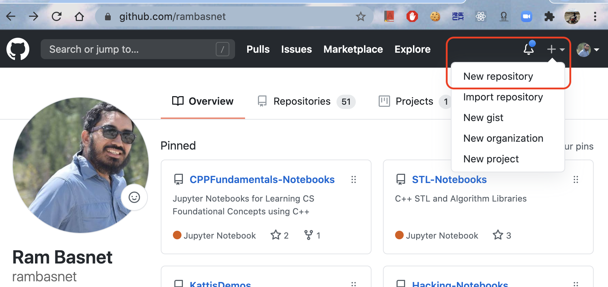
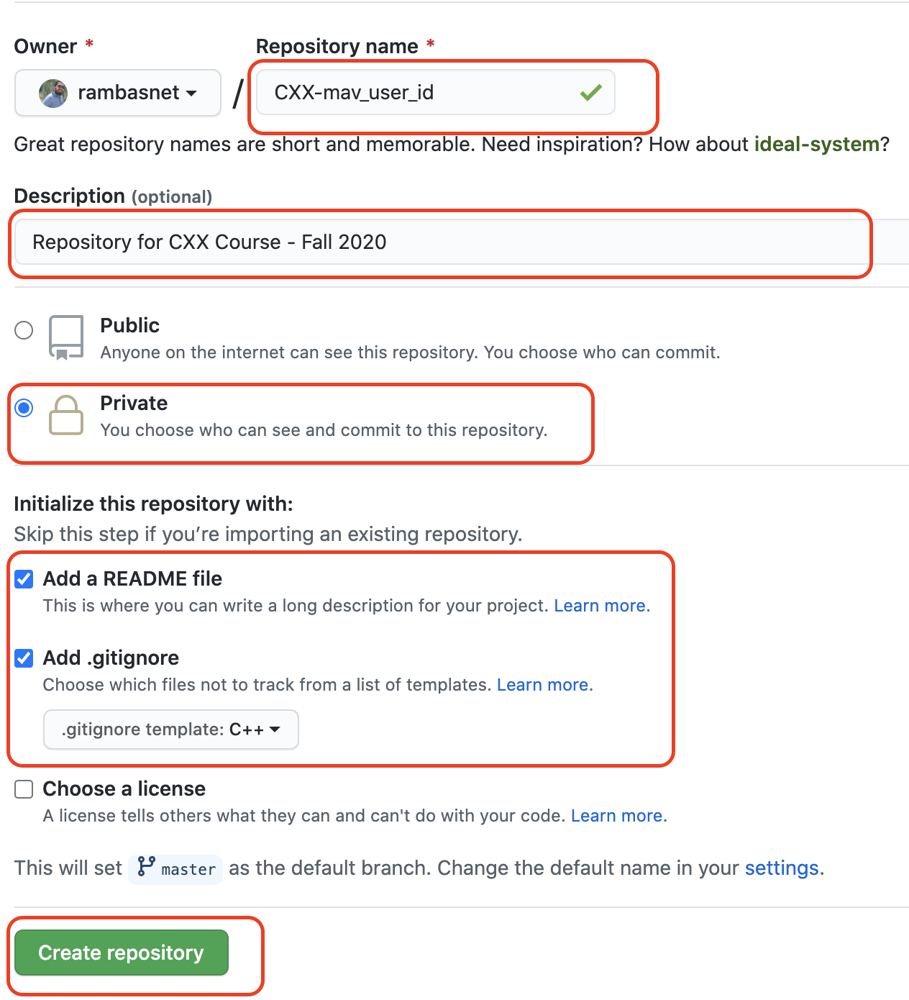
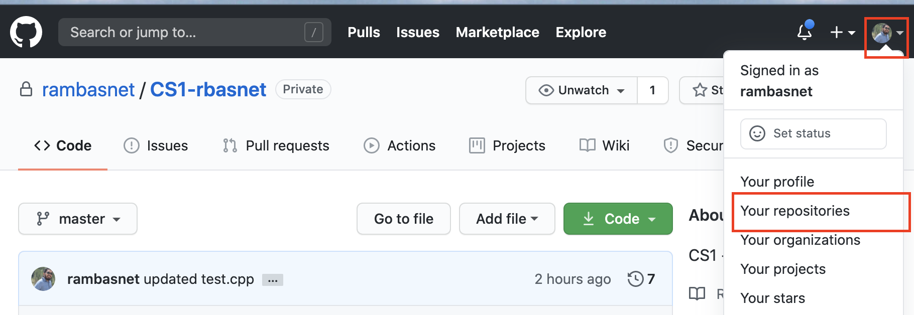
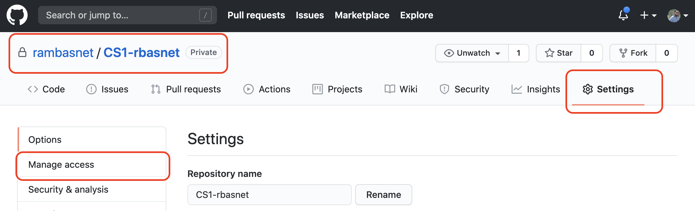
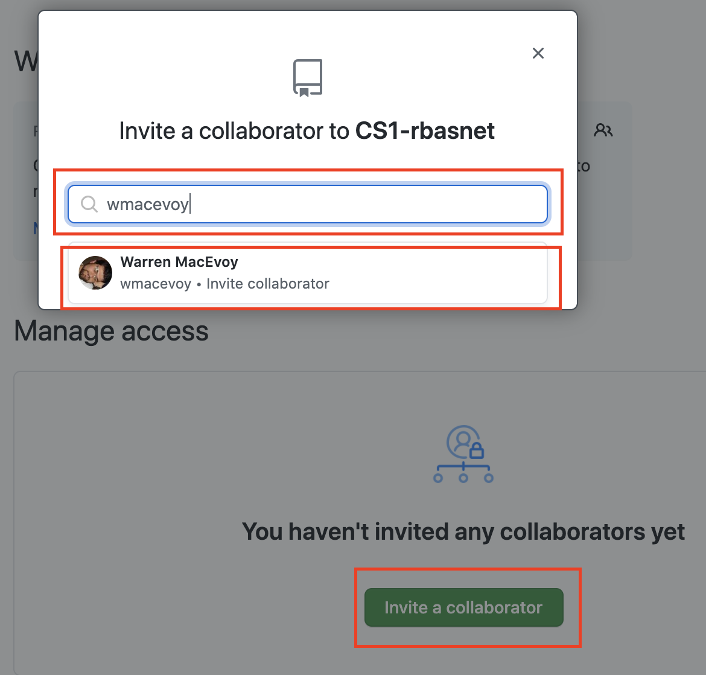
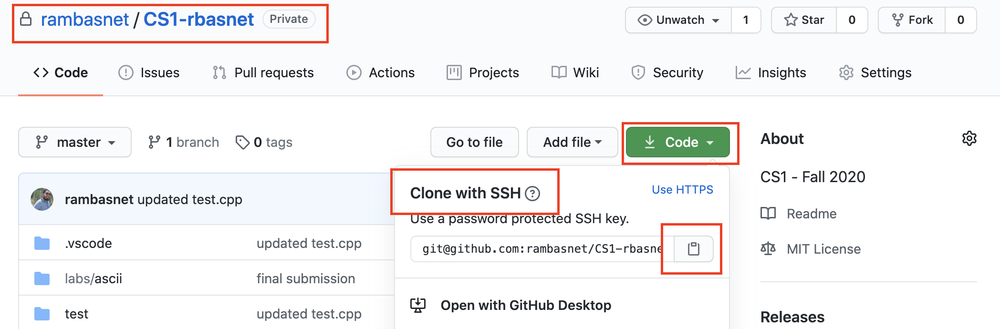

# Creating and Cloning Git Repository

Instructions on how to create and clone git repository for courses

## Create New Repository on GitHub

1. Login to your [GitHub.com](https://github.com/login) account
2. Click + button on the top right corner next to your profile

    

3. on the Create a new repository page
    - Note you can change these settings once the repo is created

    1. provide username, typically short course name/no. followed by your Mavzone username, e.g. CS1-rbasnet, CS2-rbasnet, CS0-rbasnet, AdvPy-rbasnet, AdvJS-rbasnet, CS420-rbasnet, etc.

    2. provide some description
    3. make your repo private
        - has some limitations (max # of collaborators can be 3 e.g.) for free account, but most course repo must be private so others can't see your assignments and projcts
    4. Add a README file
        - select the appropriate language from the template depnding on what language is used in the course, e.g. C++ for course using C++, Python, etc.
    5. No license is required for course repo
    6. Click Create repository once everyting is filled up

    

4. Add collaborators to your repo
    - Note: your instructor will be always one of the collaborators to check your work and grade
    - you can add your teammates if working in group
    - collaborator must have a GitHub account

    1. go to your repository's main page by clicking Profile icon -> Your Repositories menu item

    

    2. click Repository's Settings tab
    3. Manage Access

    

    4. click Invite a collaborator
    5. search collaborator by username or full name and select the right one from the list, e.g. rambasnet, wmacevoy, etc.

    

## Clone a Repository from GitHub

- You must clone the repository locally on your system inorder to add contents (files and folders etc.)
- git must be installed and ssh configured on the system see instructions inside each system specific folder

1. open Terminal on Mac and Ubuntu, Ubuntu Bash Terminal on Windows
2. change working directory if necessary using **cd** command
3. create folder structure if necessary, e.g.:
    Note: text after # is comment on Bash and can be ignored

    ```bash
    pwd   # print current direcotry's full path
    mkdir Fall2020  # Create root directory for Fall 2020 Semester
    cd Fall2020
    mdkir CS1 # create course specific directory, CS1 for CSCI 111, e.g.
    cd CS1
    ```

4. copy SSH URL from repository's main page
    1. click Clone with SSH
    2. clip a little clipboard icon to copy the URL; select and Ctrl+C on Windows/Linux or Command+C on Mac also does it

    

5. clone your course repository in the current working directory
    - paste the copied SSH URL
    - right click to paste on WSL
    - right click and Paste option on Mac on Linux Terminal
    - URL should look like git@github.com:\<username>/\<repo name>.git

    ```bash
    git clone git@github.com:rambasnet/CS1-rbasnet.git # replace with your repo's URL
    ls # notice your repo listed
    ```

6. Open the repo folder with your favourite editor (VS Code, e.g.) and create files and folders as required by the course
    - see using Git with Visual Studio Code Editor instructions

