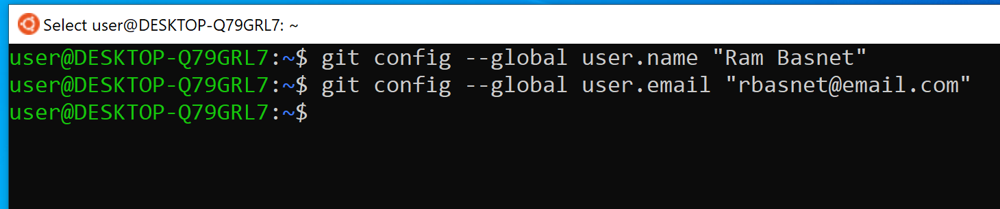
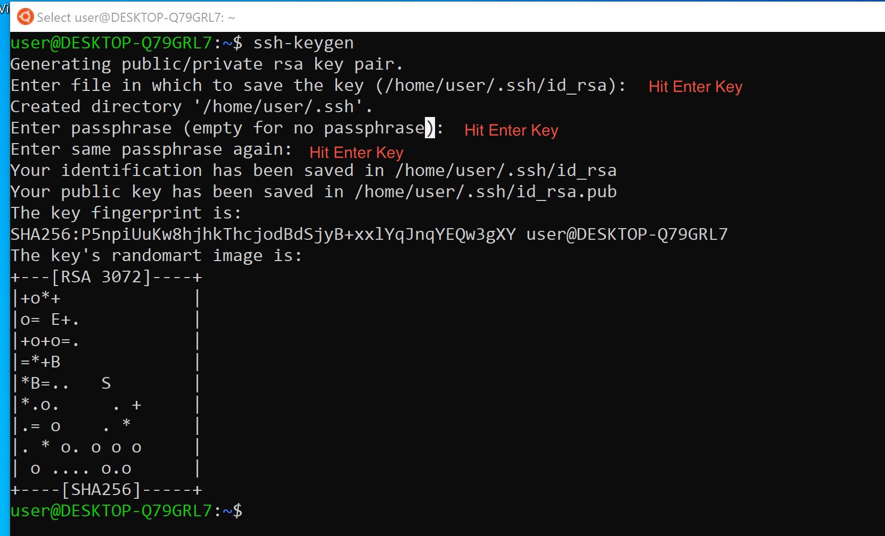
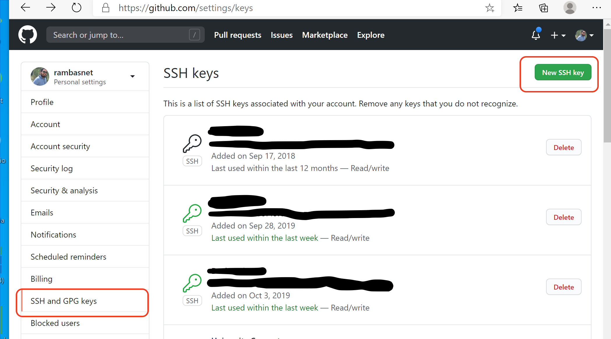
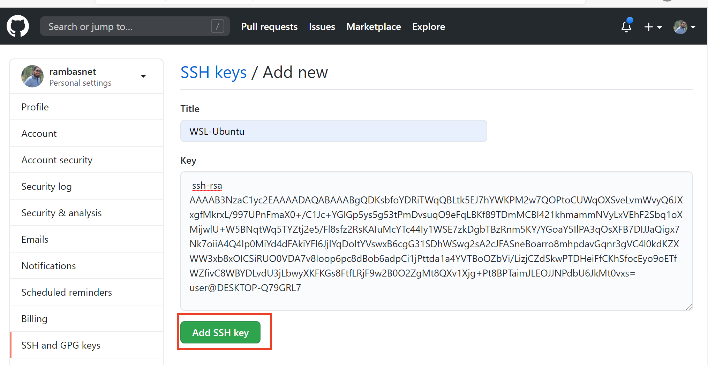
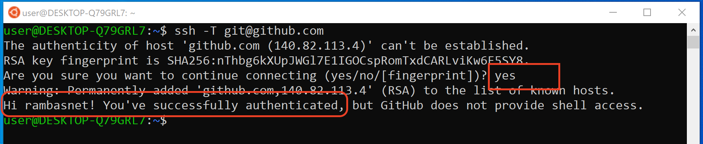

# Configure Git

- you must have git installed with Command Line Interface and Bash Terminal
- you need to configure git only once on each system you are using Git on

1. Create your free account on [https://gitub.com](https://github.com/join), if you don't have one yet
    - pick a username that closely represents you such as your firstname and lastname; depends on availability

2. open a Terminal
3. Let git know who you are. Use your real name and email you registered on GitHub

    ```bash
    git config --global user.name "<your full name>"
    git config --global user.email "<your email on github.com>"
    ```

    

4. Setup SSH Authentication
    - Note: using ssh keys is not required but is recommended as it let's you authenticate with GitHub server or other git hosting sites (GitHub, GitLab, Bitbucket, etc.) so you don't have to type username/password every time
    - and YES, you'll be have to authenticate quite frequently while pulling and pushing code from the server
        - ssh keys will make your life a lot easier

5. Generate ssh keys
    - Note: pick default location to save the key and just hit enter key for password without picking a password
    - simply hit enter until you get the **\$** prompt back

    ```bash
    ssh-keygen
    ```

    

6. list the content of the public key file to copy to GitHub

    ```bash
    cat ~/.ssh/id_rsa.pub
    ```

7. **select/highlight** the contents from: ssh-rsa…. all the way to the end and **right click** to copy
    

8. add the copied public key to GitHub profile settings
    1. click on your github avatar on your dashboard page github.com/\<username\>
    2. click Settings

    
    3. click SSH and GPG keys and New SSH key button

    
    4. enter Ctrl+v to paste the copied public key in the Key text box
        - for Title, give it a descriptive name like "WSL-Ubuntu", "Windows Laptop" where the key is copied from
    5. click Add SSH Key

    

9. Test to see if WSL Ubuntu can be authenticated with GitHub

    ```bash
    ssh -T git@github.com
    ```

    
