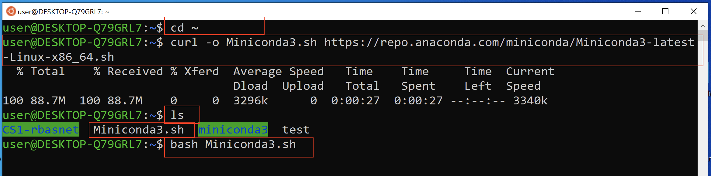

# Installing Miniconda3 Python3 Package Manager on Ubuntu

- miniconda3 install provides Python3 as well
- miniconda3 can be used to install various other Python3 packages such as jupyter notebook, machine learning libraries, etc.

1. open Ubuntu Bash Terminal
2. type or copy paste the following commands

    ```bash
    cd ~ # change current working directory to user's home directory
    curl -o Miniconda3.sh https://repo.anaconda.com/miniconda/Miniconda3-latest-Linux-x86_64.sh 
    ls # make sure you see Miniconda3.sh file in the current folder
    bash  Miniconda3.sh # run the downloaded file with bash program
    ```

    

3. follow the instructions on the screen; when you see --More--, just hit space bar key to get the end of the license terms and see >>>
    - enter **yes** to accept the license terms
    - press **ENTER key** to confirm the default location
        - this may take a while
    - enter **yes** to initialize Miniconda3

4. close and reopen Terminal once Miniconda3 is installed
5. check current conda version installed

    ```bash
    conda --version
    ```

    - if you see conda command not found error close and start a new bash terminal and type the command again

6. check python installed

    ```bash
    python --version # you should see Python 3.x.x
    ```

7. update conda

    ```bash
    conda update conda
    ```

    - enter **y** if asked to Proceed