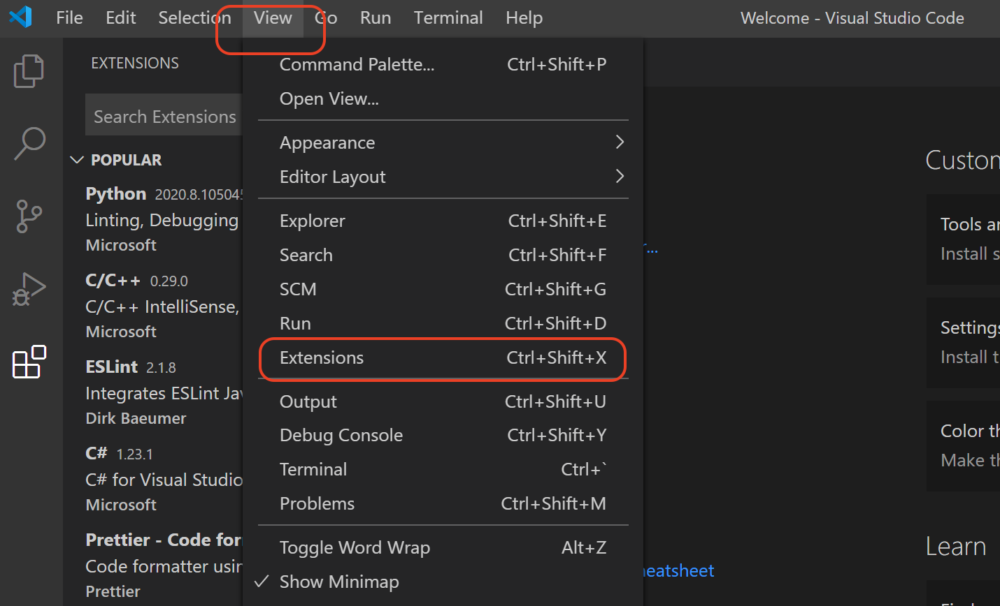
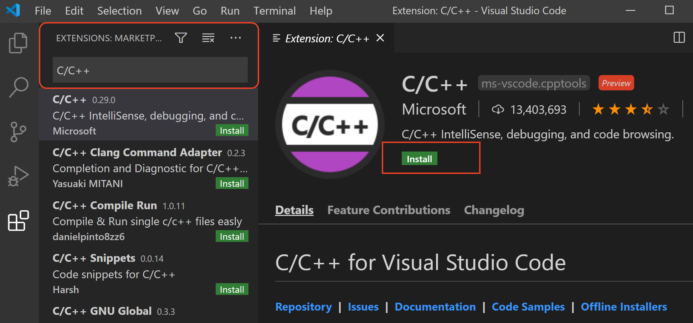

# Configure VS Code for C++ Development

## Run Extensions Marketplace

1. run Visual Studio Code
2. open extensions marketplace - View->Extensions

## Install C/C++ extension

1. open extension marketplace
2. search C/C++ and install

3. close and restart VS Code
