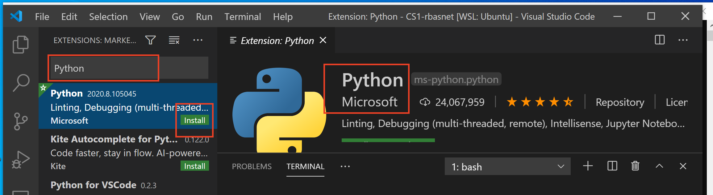

# Configure Visual Studio (VS) Code for Python Development

## Run Extensions Marketplace

1. run Visual Studio Code
2. open extensions marketplace - View->Extensions

## Install Python extension

1. open extension marketplace
2. search Python and install

3. close and start VS Code