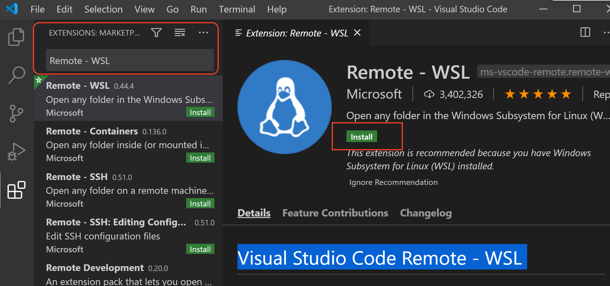

# Configure Visual Studio (VS) Code for C/C++ Development on WSL Ubuntu

## Run Extensions Marketplce

1. run Visual Studio Code
2. open extensions marketplace - View->Extensions

## Install Remote - WSL extension

1. open extension marketplace
2. search "Remote - WSL" and install

## Install C/C++ extension

1. open extension marketplace
2. search C/C++ and install

