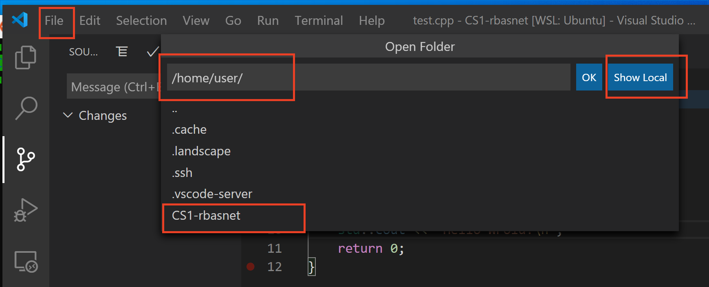
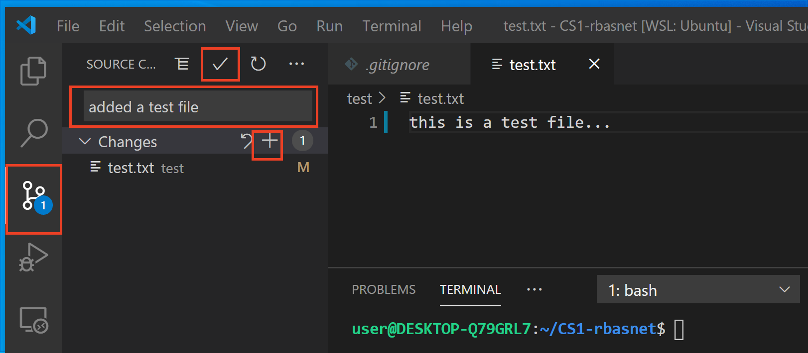
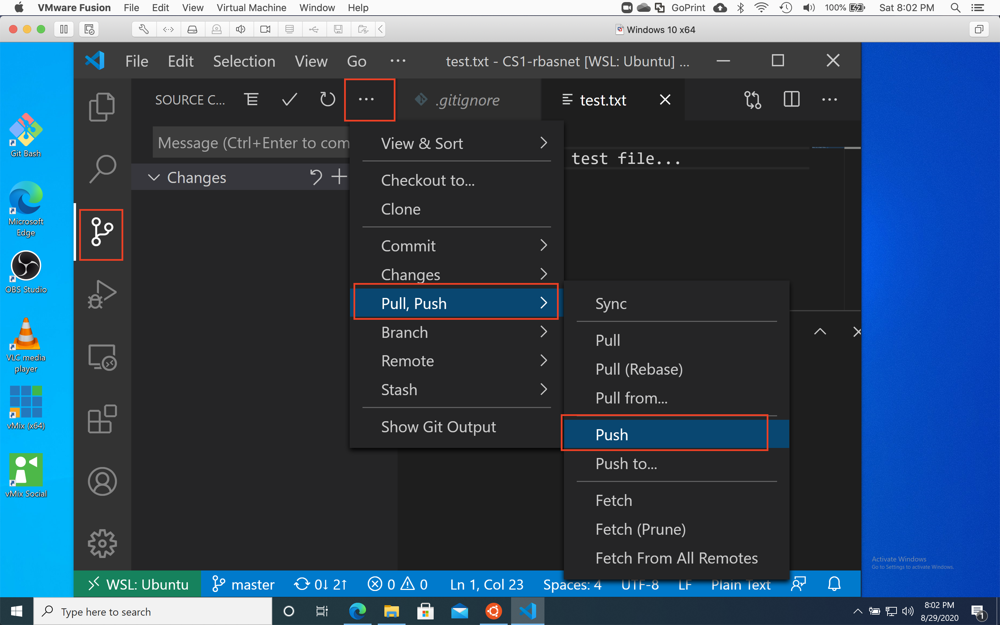

# Using Git with Visual Studio Code

- VS Code provides GUI interface to work with your git repository
- GUI interface makes it easy to work with git repository (e.g. add, commit, push, pull, etc.)
- commandline is an alternative and this document provides instructions for both GUI and Command line interface of git

## Use Git GUI Interface on VS Code

1. open VS Code on your system
    - Note that Windows WSL Ubuntu must have Remote-WSL extension installed to access files from Windows as well as WSL Ubuntu
2. display Integreted Terminal on VS Code
    - click Terminal menu and click New Terminal
    - select bash as the default shell
3. open your repository
    1. click File -> Open Folder and browse the repository folder that's cloned on the system
    - click Show Local if the repository is cloned on Windows system
    - by default it'll show folders and files on WSL Ubuntu system
    - e.g. if CS1-rbasnet is the repository cloned in user's home directory
    - hit OK button once you found your repo to open it
    
3. create a test folder and file
    1. click Explorer and create a test folder and test.txt file inside it, if you hover your mouse on repository name, you'll see New File and New Folder buttons
    - write some text to the test.txt file and save the file
    
4. track changed files and commit changes to the local repository
    1. click Source Control icon on the left panel
    2. click + on each file that you want to stage changes
    3. write some message in the text box
    4. click check button to commit locally
    
5. push changes to the remote repository (GitHub.com)
    - click more ... buttom and select Pull, Push -> Push
    
6. Check your GitHub.com repository and make sure you see test folder and test.txt file
    - if you're on the repo page, you'll need to refresh/reload the page
    
