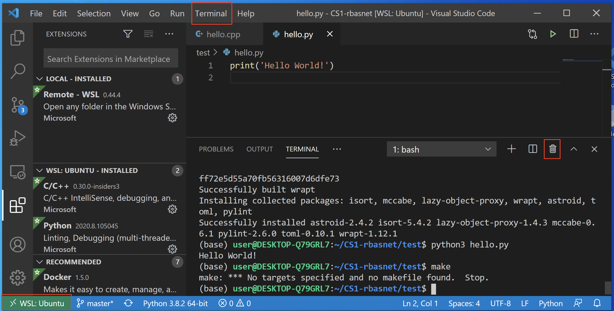
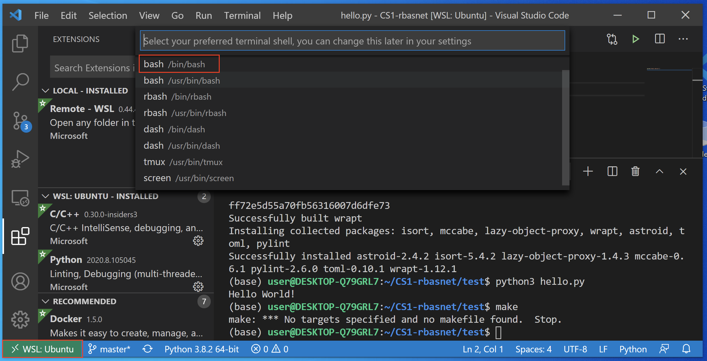

# Configure Terminal on VS Code (WSL Ubuntu)

## Open Terminal on VS Code

1. open VS Code
2. make sure you see WSL:Ubuntu green box on the bottom left corner
3. click Terminal Tab and click New Terminal from menu list

## Close Terminal on VS Code

1. click **trash can** icon on the terminal or click **x** button

## Pick Default Shell

1. Click drop-down list on terminal window
2. click **Select Default Shell**
3. pick **/bin/bash** or **WSL ...**
