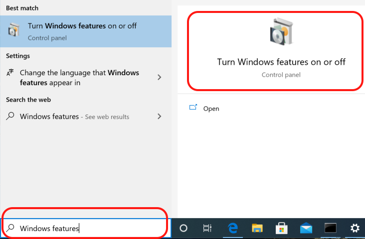
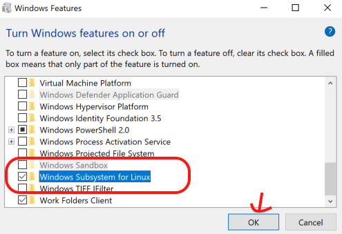
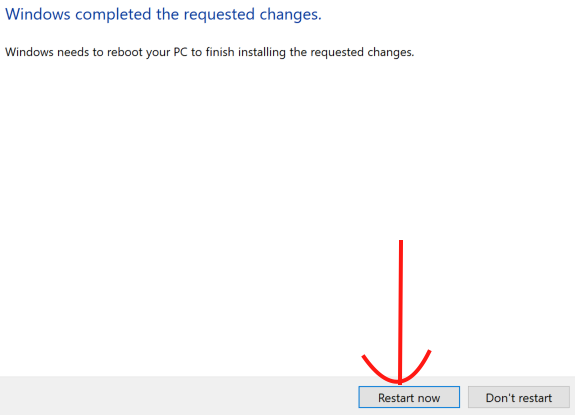
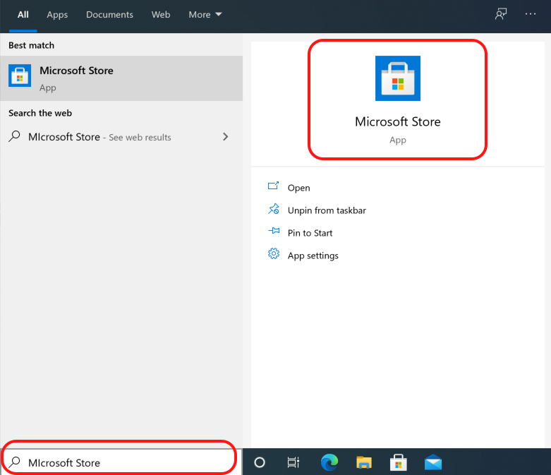
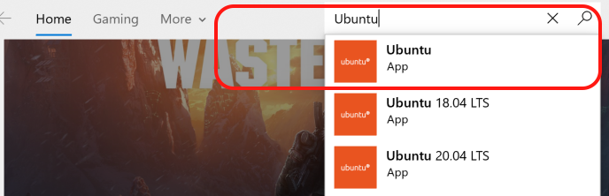
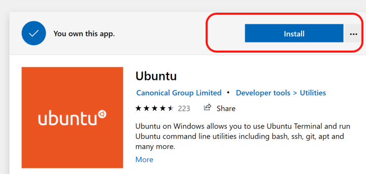
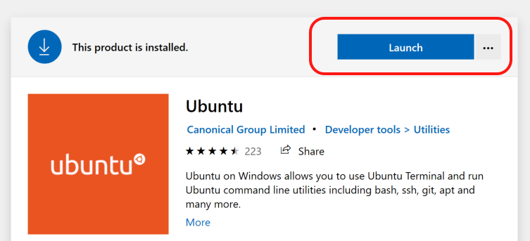
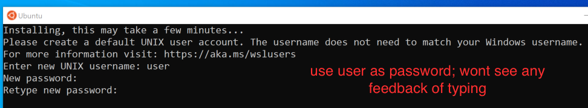
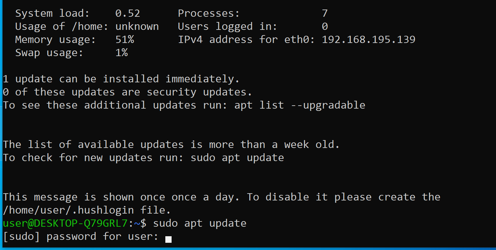

# Enable WSL and Install Ubuntu App on Windows 10 and 11

- Official Instruction for Windows 10: [https://docs.microsoft.com/en-us/windows/wsl/install-win10](https://docs.microsoft.com/en-us/windows/wsl/install-win10
)
- Windows 10 and 11 allows Ubuntu installation as an app
- follow this instruction to install WSL Ubuntu

1. turn Windows Subsystem for Linux features on following these steps:
    1. search for "Turn Windows features on or off" App without quotes

    

    2. run the Windows Feature app
    3. find and check Windows Subsystem for Linux towards the bottom of the list

    

    4. on Windows 11, Check the "Virtual Machine Platform" as well 
    5. click ok button
        - Note, it may take a while to apply the setting
    6. restart your computer

    

    Note: If the above step don't work:
    1. ensure virtualization is enabled in bios: 
    2. If errors are persisting, install the wsl2 kernel update here [https://docs.microsoft.com/en-us/windows/wsl/install-manual#step-4---download-the-linux-kernel-update-package](https://docs.microsoft.com/en-us/windows/wsl/install-manual#step-4---download-the-linux-kernel-update-package) (Under step 4)

2. install Ubuntu App following these steps
    1. search for Microsoft Store and run it

    

    2. search and open Ubuntu App

    

    3. install the Ubuntu App

    

        - Note, dowload may take some time depending on Internet speed (>4GB download)

    4. once installed, Launch the app

    

    5. when prompted, pick username and password
        - Notes: pick simple easy to remember username (e.g. user) and password (e.g. user)
        - this password is required to install other tools on Ubuntu
        - when entering password, you'll not see any feedback (* or dots); that's the Linux way of hiding password
        - just type password in the dark and hit enter; believe me it'll work!

    

3. update Ubuntu
    - type the following command on Bash Terminal

    ```bash
    sudo apt update
    ```

    

4. run Ubuntu Bash Terminal
    - search and open Ubuntu

    